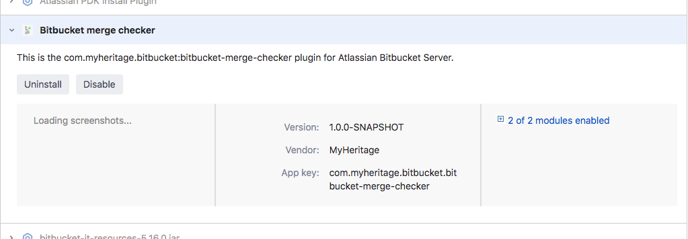
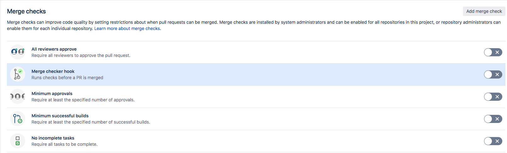
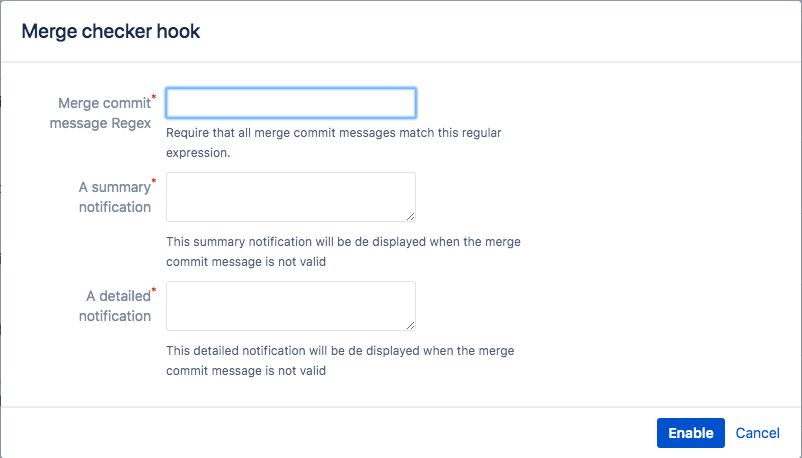

# Bitbucket Merge Checker

You always wanted a way to validate the commit message you enter when you merge a branch on Bitbucket, right? well, now you can!   
This is a simple (yet uncommon) merge checker for Bitbucket which can be customized and toggled on and off at both the Project and the Repo level.

## Getting started
### Installing
In order to enjoy the plugin you first need to install it on you Bitbucket server, and you have 2 options for that:  
> You need to have administrator permissions to be able to install plugins on your Bitbucket server
#### Option 1 :: The Marketplace
1. On Bitbucket, go to the [Marketplace](https://marketplace.atlassian.com/addons/app/bitbucket) and search for "Bitbucket merge checker"
2. Make sure the result matches this plugin
3. Complete the installation

#### Option 2 :: Installing the .jar directly
1. Download the plugin .jar file from the `dist` directory (we recommend you download it from one of the releases and not directly from the master branch).
2. Go to Bitbucket server's "Manage apps" page
3. Click on the "Upload app" link and you will get a prompt for a file upload
4. Upload the plugin .jar file you've just downloaded in step 1.
5. Make sure the plugin is enabled.

Now you should see the "Commit message merge check" plugin available among your other apps/plugins (see image below)

### Enabling
> Enabling the plugin in the Project level will enable it for the **entire** repos under it with an **inherited** configuration by default (you can later change it)
By default the plugin is disabled for all projects and repos. To activate it for a project or repo you should:
1. Go to the desired project/repo and open its settings
2. select the "Merge Checks" menu item - you will now see the list of available plugins

3. Toggle the "Merge checker hook" on. You will be prompted with the plugin configuration dialog (see image below). Currently the plugin only supports validation over commit messages.

4. Fill the fields (all are required) 
   * Merge commit message Regex - The Regex against the commit message will be validated
   * A summary notification - The summary message displayed when the commit was rejected
   * A detailed notification - The detailed message displayed when the commit was rejected. Here you might wanna elaborate on the standards the commit message should adhere to.
5. Once done you can enable (activate) the plugin

Try your new merge check!

## Contributing
We are looking forward to making this plugin even better and will appreciate any contribution in efforts to make it so.  
### Launching Bitbucket with the plugin
1. Fork the repository to you local machine
2. Download the Atlassian SDK (see more details [here](https://developer.atlassian.com/server/framework/atlassian-sdk/set-up-the-atlassian-plugin-sdk-and-build-a-project/))
3. Navigate to the repository directory on your local machine and run `atlas-run`. This will trigger the mvn goal which builds and launches a local Bitbucket server.  

Now You should be able to navigate to Bitbucket on your local machine and see the plugin installed on it. 
### Modifying and checking 
The plugin support a sort of live-reloading OOTB, which means that after each modification you made you can run `atlas-package` on the repository root directory and refresh the Bitbucket page to see your changes.

### Running tests
In order to run the tests you should run the following command from the project's root directory: `atlas-unit-test`.  
This will run the unit tests.

### Bitbucket Server version compatibility
This plugin was tested for Bitbucket-Server@5.16.0, but it might still work on lower versions than that.

### i18n support
Currently only the English language is supported.

### License
Bitbucket Merge Checker is [Apache License Version 2.0 licensed](./LICENSE).